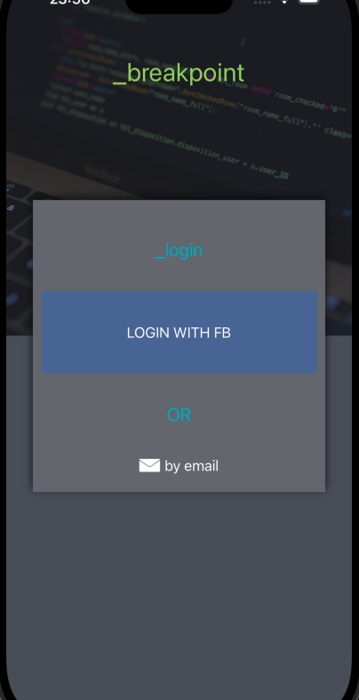
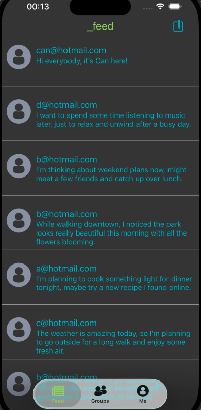
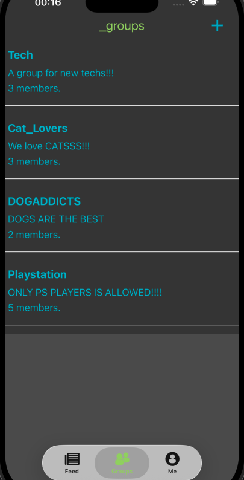
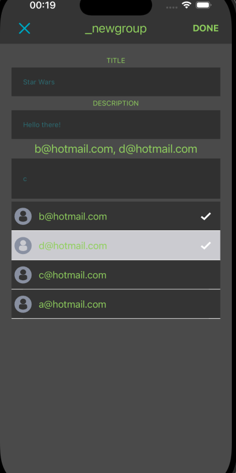
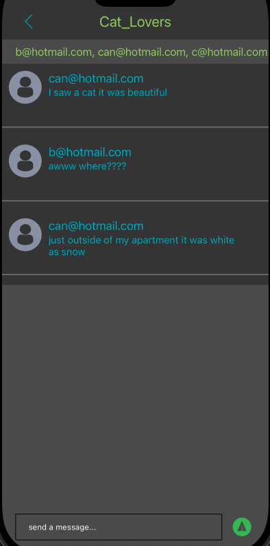

# Breakpoint

Breakpoint is a social iOS app designed around a feed experience. Users can share posts, explore community content, and create or 
join groups based on common interests. The app focuses on content sharing, group interaction, and a clean UIKit-based interface.

## Features

- Email & password authentication with Firebase Auth  
- Login with Facebook  
- Feed-based post sharing  
- Explore community content  
- Create and join interest-based groups  
- Group-based content feeds  

## Tech Stack

- Swift  
- UIKit  
- Firebase Authentication  
- Firebase Firestore  
- Firebase Storage  
- Facebook Login SDK  

## Screenshots

  
  
  
  
  
  

## Installation

1. Clone the repository  
2. Open `BreakpointApp.xcodeproj` in Xcode  
3. Configure Firebase (`GoogleService-Info.plist`)  
4. Configure Facebook Login  
5. Install dependencies if required  
6. Build and run on the simulator or a real device  

## License

This project is licensed under the MIT License.

